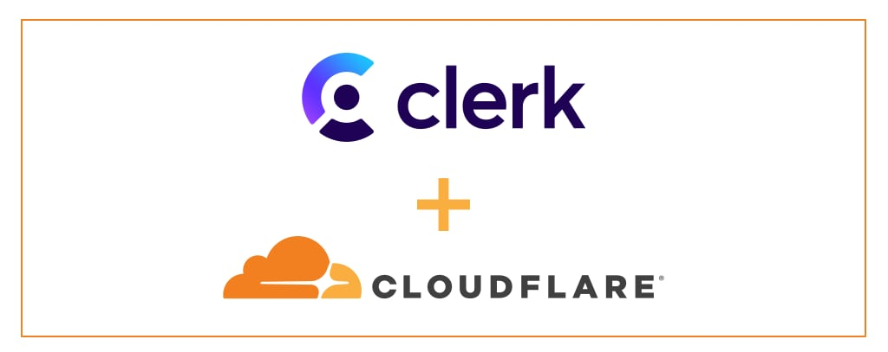

# Clerk Webhook Cloudflare Worker

A production-ready Cloudflare Worker implementation for handling Clerk webhooks with secure signature verification. This serverless solution allows you to react to Clerk events like user creation, authentication, and other user lifecycle events in a scalable, cost-effective way.



## 🚀 Features

- **Secure Webhook Verification**: Implements Clerk's webhook signature verification for security
- **Serverless Architecture**: Built on Cloudflare Workers for global edge deployment
- **TypeScript Support**: Full TypeScript implementation with type safety
- **Event-Driven**: React to Clerk events like user creation, updates, and deletions
- **Zero Infrastructure**: No servers to manage, scales automatically
- **Global Performance**: Deployed to Cloudflare's edge network worldwide

## 📋 Prerequisites

- [Cloudflare account](https://dash.cloudflare.com/sign-up)
- [Clerk account](https://clerk.com/) with webhooks configured
- [Node.js](https://nodejs.org/) (v18 or higher)
- [Wrangler CLI](https://developers.cloudflare.com/workers/wrangler/install-and-update/)

## 🛠️ Quick Start

### 1. Deploy with One Click

Click the "Deploy to Cloudflare" button above to instantly deploy this webhook handler to your Cloudflare account.

[](https://deploy.workers.cloudflare.com/?url=https://github.com/leo-ars/clerk-webhook-cloudflare-worker)

### 2. Manual Deployment

```bash
# Clone the repository
git clone https://github.com/leo-ars/clerk-webhook-cloudflare-worker.git
cd clerk-webhook-cloudflare-worker

# Install dependencies
npm install

# Deploy to Cloudflare Workers
npm run deploy
```

### 3. Configure Environment Variables

Set your Clerk webhook signing secret in the Cloudflare dashboard:

```bash
# Using Wrangler CLI
wrangler secret put CLERK_WEBHOOK_SIGNING_SECRET
```

Or set it in the Cloudflare dashboard under your Worker's Settings > Variables.

### 4. Configure Clerk Webhook

In your Clerk dashboard:

1. Go to **Webhooks** in the sidebar
2. Create a new webhook endpoint
3. Set the endpoint URL to: `https://your-worker-name.your-subdomain.workers.dev/user-created`
4. Select the events you want to listen to (e.g., `user.created`, `user.updated`)
5. Copy the signing secret and set it as `CLERK_WEBHOOK_SIGNING_SECRET`

## 🔧 Configuration

### Environment Variables

| Variable | Description | Required |
|----------|-------------|----------|
| `CLERK_WEBHOOK_SIGNING_SECRET` | Your Clerk webhook signing secret | Yes |

### Wrangler Configuration

You can customize the deployment by modifying the `wrangler.jsonc` file:

```jsonc
{
  "$schema": "node_modules/wrangler/config-schema.json",
  "name": "clerk-webhook-cloudflare-worker",
  "main": "src/index.ts",
  "compatibility_date": "2025-06-20",
  "observability": {
    "enabled": true
  },
  "compatibility_flags": [
    "nodejs_compat"
  ],
  "preview_urls": false,
  "routes": [
    {
      "pattern": "webhook-clerk.example.com",
      "custom_domain": true
    }
  ]
}
```

**Configuration Options:**
- `preview_urls: false` - Disables public preview URLs for security
- `routes` - Configure custom hostnames for your webhook endpoint
- `custom_domain: true` - Enables custom domain routing

### Supported Events

The webhook handler is currently configured for the `/user-created` endpoint. You can extend it to handle additional events:

- `user.created` - When a new user is created
- `user.updated` - When user data is updated
- `user.deleted` - When a user is deleted
- `session.created` - When a new session is created
- `session.revoked` - When a session is revoked

## 📁 Project Structure

```
clerk-webhook-cloudflare-worker/
├── src/
│   └── index.ts          # Main webhook handler
├── test/
│   └── index.spec.ts     # Unit tests
├── wrangler.jsonc        # Cloudflare Workers configuration
├── package.json          # Dependencies and scripts
└── README.md            # This file
```

## 🔒 Security

This implementation includes several security measures:

- **Webhook Signature Verification**: Uses Clerk's `verifyWebhook` function to validate incoming requests
- **Environment Variable Protection**: Sensitive data stored as Cloudflare Workers secrets
- **Error Handling**: Graceful error handling without exposing sensitive information
- **Request Validation**: Validates webhook payload structure

## 🧪 Testing

Run the test suite:

```bash
npm test
```

The tests verify that the webhook handler responds correctly to various scenarios.

## 🚀 Development

Start the development server:

```bash
npm run dev
```

This will start a local development server at `http://localhost:8787`.

## 📊 Monitoring

The worker includes observability features enabled by default. You can monitor:

- Request logs in the Cloudflare dashboard
- Error rates and performance metrics
- Webhook delivery status

## 🔄 Extending the Webhook Handler

To add support for additional Clerk events, modify the `src/index.ts` file:

```typescript
// Add new endpoints for different events
app.post('/user-updated', async (c) => {
  // Handle user.updated events
});

app.post('/session-created', async (c) => {
  // Handle session.created events
});
```

## 🤝 Contributing

1. Fork the repository
2. Create a feature branch (`git checkout -b feature/amazing-feature`)
3. Commit your changes (`git commit -m 'Add amazing feature'`)
4. Push to the branch (`git push origin feature/amazing-feature`)
5. Open a Pull Request

## 📄 License

This project is licensed under the MIT License - see the [LICENSE](LICENSE) file for details.

## 🆘 Support

- **Documentation**: [Cloudflare Workers Docs](https://developers.cloudflare.com/workers/)
- **Clerk Documentation**: [Clerk Webhooks](https://clerk.com/docs/webhooks/overview)
- **Issues**: [GitHub Issues](https://github.com/yourusername/clerk-webhook-cloudflare-worker/issues)

## 🔗 Related Resources

- [Clerk Webhook Events](https://clerk.com/docs/webhooks/overview)
- [Cloudflare Workers Documentation](https://developers.cloudflare.com/workers/)
- [Hono Framework](https://hono.dev/) - The web framework used in this project

---

**Built with ❤️ using Cloudflare Workers and Clerk**